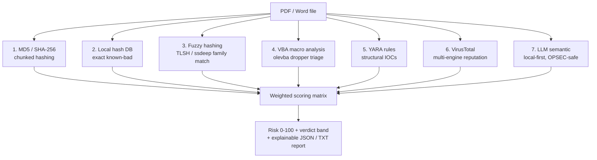
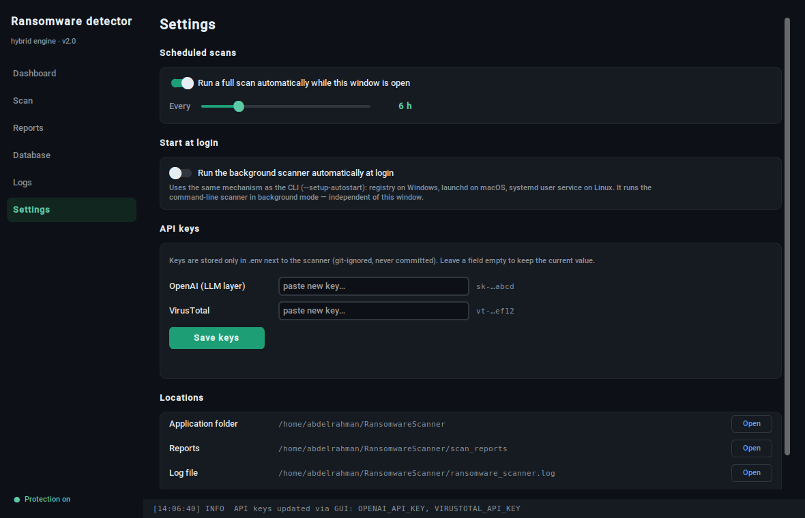

# 🛡️ Hybrid Ransomware Detection System


A multi-layered scanner that inspects **PDF and Microsoft Word documents** for ransomware and other malicious indicators. It fuses **seven independent detection signals** — cryptographic hashing, a local malware-hash dataset, **fuzzy/structural hashing**, **VBA macro analysis**, a **YARA rules engine**, multi-engine reputation via VirusTotal, and **local-first LLM** semantic analysis — through a **transparent weighted scoring matrix** that produces a 0–100 risk score, a verdict band, and a readable report showing *why* each file scored what it did.

Runs on **Windows, macOS, and Linux** (x86_64 and ARM64), including optional autostart-at-login on each platform.

Originally built as my B.Sc. graduation project as a three-layer scanner, then extended with structural detection (fuzzy hashing, macros, YARA), an OPSEC-preserving local LLM option, and a weighted scoring matrix. It is intended for **defensive and educational use** — analysing suspicious documents, not creating malware.

---

## 📖 Table of Contents

- [🧩 Why "hybrid"?](#-why-hybrid)
- [🔬 Detection layers](#-detection-layers)
- [✨ Features](#-features)
- [📦 Requirements](#-requirements)
- [🚀 Installation](#-installation)
- [🔑 Configuration](#-configuration)
- [💻 Usage](#-usage)
- [🪟 Graphical interface](#-graphical-interface)
- [📂 Project structure](#-project-structure)
- [🌐 Cross-platform & architecture notes](#-cross-platform--architecture-notes)
- [🧭 Roadmap](#-roadmap)
- [🚨 Disclaimer](#-disclaimer)
- [👤 Author](#-author)

---

## 🧩 Why "hybrid"?

Most lightweight scanners rely on a single technique (usually a hash lookup), which misses anything not already in a database. This tool layers seven complementary approaches — exact, structural, behavioural, reputational, and semantic — so a file flagged by **any** of them is surfaced, and the **weighted scoring matrix** ensures the verdict reflects *which kind* of evidence fired (a real exec primitive in a macro counts for far more than a phishing-flavoured sentence):



The signals fall into three weight categories — **technical** (hash DB, fuzzy, macros, YARA), **reputation** (VirusTotal), and **semantic** (LLM) — and technical evidence is designed to mathematically outweigh semantic evidence.

---

## 🔬 Detection layers

1. **Cryptographic hashing (static).** Computes the file's MD5 **and SHA-256** using memory-efficient **chunked reads** (constant memory regardless of file size).
2. **Local hash database (exact known-bad).** Checks the MD5 against a **streamed CSV** of known-malicious hashes loaded into an **O(1) lookup set**. Instant, offline detection of known samples.
3. **Fuzzy / structural hashing (polymorphic families).** Computes **TLSH** and **ssdeep** (via the pure-Python `ppdeep`) digests and compares them against a signature database of *confirmed* malicious samples. Because these digests stay *similar* when a file stays *structurally similar*, this catches polymorphic variants whose exact SHA-256 has never been seen — exactly the gap an exact-hash blocklist leaves open. Match distance/similarity is reported as evidence.
4. **VBA macro analysis (Office dropper mechanism).** Uses **`oletools` / `olevba`** to statically extract and triage embedded VBA/XLM macros **without ever executing them**. It buckets findings into auto-run triggers (`AutoOpen`, `Document_Open`, …), execution/download primitives (`Shell`, `CreateObject`, `URLDownloadToFile`, `powershell`, …), other suspicious calls, and extracted IOCs. An auto-run trigger **combined with** an exec primitive is the classic dropper pattern and is scored accordingly.
5. **YARA rules engine (structural IOCs).** Compiles every `.yar` / `.yara` file in `rules/` (namespaced) and scans each file against them. Rules ship with a `severity` meta (`low`/`medium`/`high`/`critical`) that the scoring matrix reads. The bundled rules are original triage heuristics for ransom-note language, extortion + urgency combinations, Bitcoin-address-with-payment context, PowerShell download cradles, and Office dropper structures — drop in your own rules to extend coverage. Only matched **string identifiers** are recorded, never the raw matched bytes.
6. **VirusTotal (threat intelligence).** Submits the file hash to the VirusTotal v3 API and reads how many engines flag it, producing a detection ratio.
7. **LLM semantic analysis (local-first, OPSEC-preserving).** Extracts visible document text (PyPDF2 / python-docx, with **OCR fallback** via Tesseract + Poppler for scanned PDFs) plus raw printable strings, and asks an LLM whether the content looks like a phishing/ransomware lure, returning a confidence score and a list of suspicious elements.
   - **OPSEC by default.** The backend is pluggable. With `LLM_PROVIDER=auto` (the default) the scanner prefers a **local Ollama** model if one is reachable, so **potentially sensitive documents never leave the machine**. It falls back to the cloud (OpenAI) only if no local model is available *and* an API key is set; every cloud call is logged as egress. Set `LLM_PROVIDER=ollama` to force local-only, or `none` to disable the layer.
   - **Prompt-injection hardening.** The untrusted file content is passed in a separate **user** role from the **system** instructions and the model runs at `temperature = 0`, hardening this step against a malicious document trying to talk the model into a "safe" verdict.

### Weighted scoring matrix

The original hardcoded severity equation (`10·db + 5·llm + 5·vt`) gave a *semantic* signal the same weight as multi-engine reputation and could not express that a structural indicator is far more damning than a suspicious sentence. It has been replaced by a **transparent weighted matrix** (`detectors/scoring.py`). Every signal contributes through an explicit rule with a **category**, a **weight**, and a human-readable **detail**, governed by three principles:

1. **Technical > semantic, mathematically.** Technical indicators (local-DB hit, YARA, macro exec primitives, fuzzy family match) carry the heaviest weights. The semantic (LLM) category is **capped low**, so a phishing lure can never by itself out-score a real structural indicator.
2. **Semantic-alone cannot be "High".** If no technical or reputation signal fired, the verdict is clamped to at most **Medium**, no matter how confident the LLM was about the prose.
3. **Explainability.** The result carries a full per-indicator breakdown, so the report shows exactly which signals drove the verdict and by how much.

Two scores are produced: a granular **risk score (0–100)** with verdict bands, and the **legacy severity score (0–10)** (`risk / 10`) kept so existing reports, the GUI, and tests keep working — a pure local-DB hit still yields exactly `10.0`, a clean file `0.0`.

| Risk score | Verdict |
|-----------:|---------|
| 0 | Clean |
| 1–24 | Low |
| 25–49 | Medium |
| 50–79 | High |
| 80–100 | Critical |

A file is marked **malicious** if any layer fires. **Every optional layer degrades gracefully** — missing libraries (`python-tlsh`, `ppdeep`, `oletools`, `yara-python`), a missing local model, or missing API keys produce warnings, not crashes, and the remaining layers still run.

---

## ✨ Features

- Scans `.pdf`, `.docx`, and `.doc` files across one or more directories.
- **Seven independent detection layers** fused through a transparent, **explainable weighted scoring matrix** (risk 0–100 + verdict band, with a full evidence trail per file).
- **Structural detection** that survives polymorphism and obfuscation: fuzzy hashing (TLSH/ssdeep), static VBA macro triage (olevba), and a YARA engine you can extend with your own rules.
- **OPSEC-preserving LLM layer** — local Ollama by default so sensitive documents stay on the machine, with a cloud fallback only when explicitly available; cloud egress is logged.
- **Desktop GUI** (`gui.py`) — dark dashboard with live scan progress, per-layer result breakdown, report browser, dataset import, live logs, and settings. The CLI remains fully independent.
- Single-file scan and a fuzzy-hash helper from the CLI (`--scan-file`, `--fuzzy-hash`) for quick triage and growing your signature DB.
- OCR fallback so image-only / scanned PDFs are still analysed.
- Detailed **JSON** report + human-readable **TXT** summary per scan, grouped by verdict band.
- Scheduled background scanning (default: every 6 hours).
- **Cross-platform autostart at login** — Windows (registry), macOS (launchd), Linux (systemd user service, with a cron fallback).
- Optional desktop shortcut/launcher (Windows `.lnk`, Linux `.desktop`).
- File + console logging.

---

## 📦 Requirements

**Python:** 3.9+ (see `requirements.txt` — all dependencies provide x86_64 and ARM64 wheels, so installation needs no compiler).

**Detection-layer libraries (optional, recommended).** The structural layers use `python-tlsh` + `ppdeep` (fuzzy hashing), `oletools` (macro analysis), and `yara-python` (YARA). All ship prebuilt wheels (or are pure-Python) for x86_64 and ARM64 on Windows/macOS/Linux, so `pip install -r requirements.txt` pulls them with no compiler. If any are absent, that layer is simply skipped.

**Local LLM (optional, for OPSEC).** To keep documents on-machine, install **[Ollama](https://ollama.com)** and pull a model, then the scanner uses it automatically:

```bash
ollama pull llama3.1          # or any chat model you prefer
# the scanner auto-detects a running Ollama at http://localhost:11434
```

No extra Python package is needed — the scanner talks to Ollama over HTTP. If Ollama isn't running and no OpenAI key is set, the semantic layer is skipped.

**System packages — Tesseract OCR + Poppler.** These are external programs (not Python packages) that `pytesseract` and `pdf2image` call under the hood. They are required only for the **OCR fallback on scanned/image-only PDFs**; the rest of the scanner works without them.

- **Windows:** install **Tesseract OCR** and **Poppler**, and add both to your `PATH`.
- **macOS:** `brew install tesseract poppler`
- **Linux (Debian/Ubuntu):** `sudo apt-get install tesseract-ocr poppler-utils`

**For the GUI only — Tkinter.** Bundled with the official Python installers on Windows and macOS. On minimal Linux installs: `sudo apt-get install python3-tk`.

---

## 🚀 Installation

```bash
git clone https://github.com/Abdelrahman-El-Maghraby/hybrid-ransomware-detector.git
cd hybrid-ransomware-detector

python -m venv .venv
# Windows:        .venv\Scripts\activate
# macOS / Linux:  source .venv/bin/activate

pip install -r requirements.txt
```

## 🔑 Configuration

API keys and the LLM backend are loaded from a local `.env` file and are **never** stored in the code.

```bash
cp .env.example .env        # Windows: copy .env.example .env
```

Then edit `.env`. The key settings:

```
LLM_PROVIDER=auto                      # auto | ollama | openai | none
OLLAMA_HOST=http://localhost:11434     # used by auto/ollama
OLLAMA_MODEL=llama3.1
OPENAI_API_KEY=                         # leave blank to stay fully local
VIRUSTOTAL_API_KEY=your-virustotal-api-key
```

> The cryptographic-hash, fuzzy, macro, and YARA layers work with **no keys at all**. VirusTotal needs a key; the LLM layer needs either a running Ollama (recommended, keeps data local) or an OpenAI key. Anything missing is skipped gracefully.

### Malware-hash dataset

The local database is a CSV with at least the columns `FileName`, `md5Hash`, and `Benign` (where `Benign = 0` marks a malicious entry). Import it with:

```bash
python RansomwareScanner.py --import-database /path/to/your/dataset.csv
```

A suitable dataset can be sourced from public malware-hash collections on Kaggle. (The dataset itself is intentionally **not** committed to this repo.)

### Fuzzy signature database

Fuzzy hashing matches files against the digests of *confirmed* malicious samples. To grow your own database, print a sample's digests and paste them into a signature entry:

```bash
python RansomwareScanner.py --fuzzy-hash /path/to/confirmed_sample
```

The signature file (`fuzzy_signatures.json`, format documented in the bundled `fuzzy_signatures.sample.json`) looks like:

```json
{
  "version": 1,
  "signatures": [
    {"family": "Acme.Locker", "tlsh": "T1...", "ssdeep": "3:...", "note": "source / provenance"}
  ]
}
```

Point the scanner at it with `FUZZY_SIGNATURE_DB` in `.env` (it uses the bundled sample otherwise). **Never commit live malware** — only its fuzzy digests.

### YARA rules

Every `.yar` / `.yara` file in `rules/` is compiled automatically. Add your own files there (or point `YARA_RULES_DIR` elsewhere). Give each rule a `severity` meta (`low`/`medium`/`high`/`critical`) so the scoring matrix can weight it.

---

## 💻 Usage

```bash
# Launch the graphical interface
python gui.py
# (equivalent)
python RansomwareScanner.py --gui

# Run a one-off scan now
python RansomwareScanner.py --scan-now

# Scan a single file and print its full multi-layer verdict
python RansomwareScanner.py --scan-file suspicious.docx

# Override the LLM backend for one run (e.g. force local-only or disable it)
python RansomwareScanner.py --scan-file suspicious.docx --llm-provider ollama
python RansomwareScanner.py --scan-now --llm-provider none

# Print a file's fuzzy digests (to add to your signature DB)
python RansomwareScanner.py --fuzzy-hash confirmed_sample.bin

# Run continuously in the background with scheduled scans
python RansomwareScanner.py --background

# Import / update the local hash dataset
python RansomwareScanner.py --import-database dataset.csv

# Autostart at login (auto-detects Windows / macOS / Linux)
python RansomwareScanner.py --setup-autostart
python RansomwareScanner.py --remove-autostart

# Desktop shortcut / launcher (Windows & Linux)
python RansomwareScanner.py --create-shortcut
```

Scan directories, file extensions, and the scan interval are configured in the `CONFIG` block near the top of `RansomwareScanner.py`. All paths are derived from the user's home directory via `pathlib`, so they adapt automatically to the host OS.

---

## 🪟 Graphical interface

A desktop front-end built with CustomTkinter that uses the scanner as a library — the CLI keeps working exactly as before, and both share the same configuration, reports, and hash database.


**Dashboard.** Each detection layer gets a status card — hash database, fuzzy hashing (with signature count), macro analysis, YARA (with rule-file count), VirusTotal, and the LLM layer (showing its **LOCAL vs CLOUD** posture). Scans run with live per-file progress, and every result row shows a compact per-layer breakdown (e.g. `DB– fuzzy– macro! yara✓3 VT 14/72 AI 0.80`) next to a 0–100 risk bar and the verdict band. Double-click any row for the full breakdown on that file.


**Result detail.** The verdict band and risk score up top, then what each of the seven layers concluded — fuzzy digests and family match, macro auto-run/exec primitives, matched YARA rules with their severities, VirusTotal counts (with a link to the report), and the LLM's suspicious elements — followed by the **weighted score breakdown** showing exactly which signals drove the verdict and by how many points.


**Scan, Reports, Database, Logs, Settings.** Manage monitored directories and file types, browse past JSON/TXT reports, import the malware-hash dataset, follow the live log stream, schedule recurring scans, toggle start-at-login (same mechanism as `--setup-autostart`), and store API keys — keys are written only to the git-ignored `.env` file, never anywhere else.



Engineering notes: scanning runs in a worker thread and communicates with the UI through queues (Tkinter is not thread-safe); *Stop* cancels cleanly after the file currently being scanned; results stream into the table as each file completes.

### How autostart works per platform

| OS | Mechanism | Where it lives |
|----|-----------|----------------|
| Windows | Registry `Run` key | `HKCU\Software\Microsoft\Windows\CurrentVersion\Run` |
| macOS | launchd LaunchAgent | `~/Library/LaunchAgents/com.abdelrahman.ransomwarescanner.plist` |
| Linux | systemd **user** service (cron `@reboot` fallback) | `~/.config/systemd/user/ransomware-scanner.service` |

`--remove-autostart` cleanly reverses whichever mechanism was used.

### Example report (summary)

```
Ransomware Scan Report
======================
Timestamp:              2026-06-14 09:59:08
Total files scanned:    24
Files flagged:          1
Highest verdict:        Critical
Detection layers used:  hashes, local-db, fuzzy, macro, yara, llm, virustotal
LLM posture:            LOCAL (llama3.1)

Verdict breakdown:  Critical: 1 | High: 0 | Medium: 0 | Low: 0

============================================================
CRITICAL (1)
============================================================

- File:     /home/me/Downloads/invoice.docm
  Verdict:  Critical (risk 92/100, severity 9.2/10)
  MD5:      9f2a...c41e
  [Macro]     Auto-run trigger(s): AutoOpen.
  [Macro]     Execution/download primitive(s): Shell, URLDownloadToFile.
  [Macro]     -> Auto-exec + exec primitive = classic dropper pattern.
  [YARA]      Rule(s) matched [Office_Macro_Payload_Download] (top severity 'high').
  [VT]        14 malicious / 72 engines.
  Score breakdown:
    +  22.0  [technical] macro_autoexec
    +  48.0  [technical] macro_exec_primitive
    +  20.0  [technical] macro_dropper_synergy
    +  65.0  [technical] yara_match
    +  35.0  [reputation] virustotal
    = category totals: technical=100.0, reputation=35.0
```

A full machine-readable `ransomware_scan_<timestamp>.json` (with the complete per-layer evidence trail) is written alongside the text summary.

---

## 📂 Project structure

```
hybrid-ransomware-detector/
├── RansomwareScanner.py        # main scanner + CLI (cross-platform)
├── gui.py                      # desktop GUI (uses the scanner as a library)
├── test_smoke.py               # functional + scoring/regression smoke tests
├── detectors/                  # modular, independently-optional detection engines
│   ├── __init__.py
│   ├── fuzzy_hash.py           # TLSH + ssdeep structural hashing
│   ├── macro_analysis.py       # olevba VBA/XLM macro triage
│   ├── yara_engine.py          # YARA rule compilation + scanning
│   ├── llm_backends.py         # pluggable LLM (local Ollama / cloud OpenAI / none)
│   └── scoring.py              # transparent weighted scoring matrix
├── rules/                      # YARA rules (drop in your own .yar files)
│   ├── ransomware_generic.yar
│   └── office_dropper.yar
├── fuzzy_signatures.sample.json # documented placeholder fuzzy signature DB
├── docs/                       # screenshots + DETECTION_v3.md design doc
├── requirements.txt
├── CHANGELOG.md
├── .env.example                # template for keys + LLM backend settings
├── .gitignore
├── LICENSE
└── README.md
```

See [`docs/DETECTION_v3.md`](docs/DETECTION_v3.md) for a deep dive on each layer and the scoring design, and [`CHANGELOG.md`](CHANGELOG.md) for the version history.

---

## 🌐 Cross-platform & architecture notes

- **OS-aware paths:** all runtime paths (app dir, logs, reports, default scan folder) are built from `Path.home()`, so nothing is hardcoded to a single OS.
- **No architecture lock-in:** dependencies are pure-Python or ship both x86_64 and ARM64 wheels (Windows/macOS/Linux), so `pip install` resolves the right build automatically — including Apple Silicon.
- **Graceful degradation:** missing API keys, missing OCR binaries, or missing scan folders produce warnings, not crashes.

---

## 🧭 Roadmap

Delivered in v3.0.0: fuzzy hashing, macro analysis, a YARA engine, a local-first
LLM backend, and a configurable weighted scoring matrix (see the
[changelog](CHANGELOG.md)). Next on the list:

- **Behavioural / static heuristics:** Shannon-entropy analysis (encryption indicator), NTFS Alternate Data Stream (ADS) detection, hidden-content detection, and file-integrity baselining.
- **GUI controls for the new layers:** in-app LLM-provider selector and per-layer toggles (today the LLM backend is chosen via `.env` / `--llm-provider`).
- **Richer detection content:** a broader bundled YARA rule set and a curated starter fuzzy-signature database.
- **Optional dynamic analysis:** sandboxed macro detonation for higher-fidelity verdicts.

---

## 🚨 Disclaimer

This project is for **educational and defensive** purposes only — identifying potentially malicious documents. Do not use it to create or distribute malware. Always analyse untrusted files in an isolated environment.

## 👤 Author

**Abdelrahman El-Maghraby** — Cybersecurity Specialist
[LinkedIn](https://www.linkedin.com/in/abdelrahman-el-maghraby/)

Released under the [MIT License](LICENSE).
