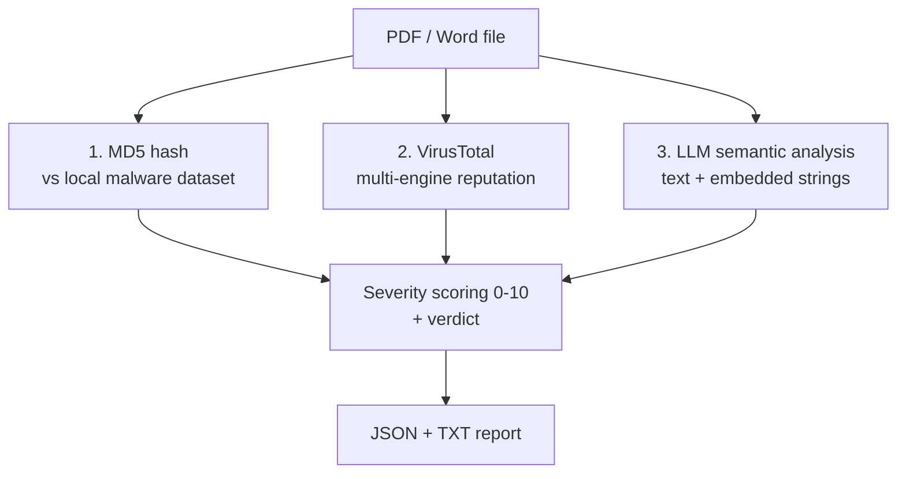
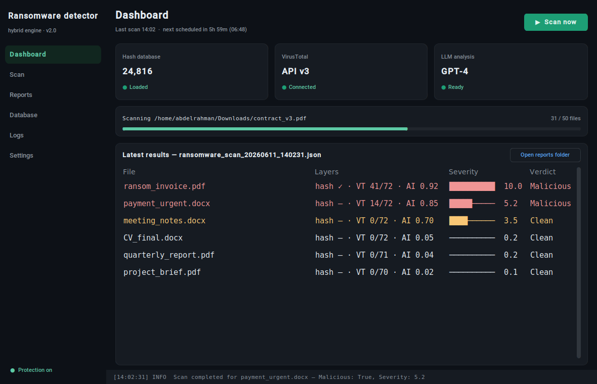
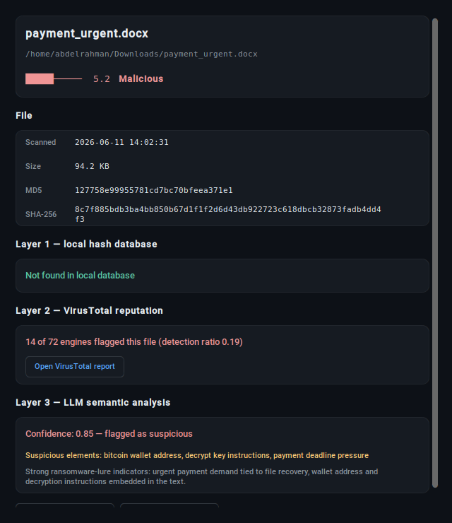
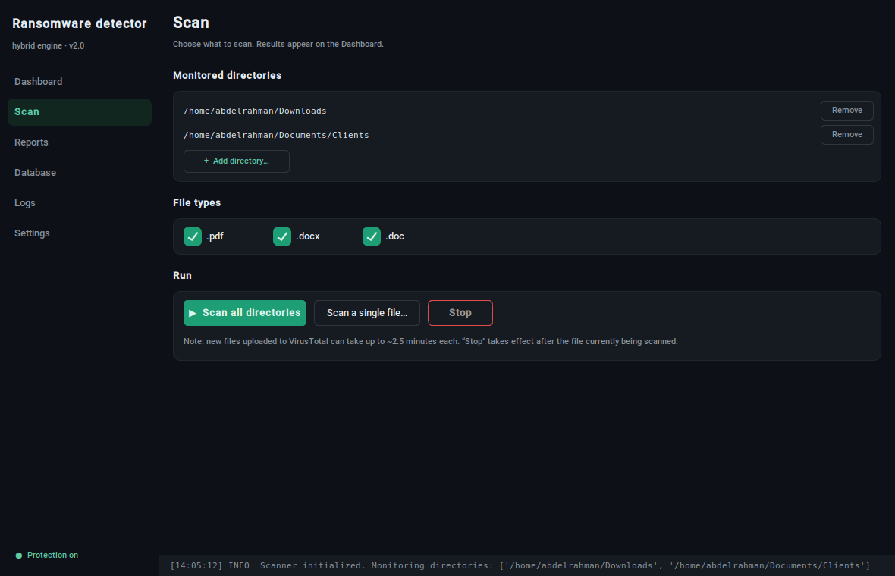

# Hybrid Ransomware Detection System


A multi-layered scanner that inspects **PDF and Microsoft Word documents** for ransomware and other malicious indicators. It combines three independent detection signals — a local malware-hash dataset, multi-engine reputation via VirusTotal, and LLM-based semantic analysis — then fuses them into a single 0–10 severity score and a readable report.

Runs on **Windows, macOS, and Linux** (x86_64 and ARM64), including optional autostart-at-login on each platform.

Built as my B.Sc. graduation project (Grade: B+). It is intended for **defensive and educational use** — analysing suspicious documents, not creating malware.

---

## Why "hybrid"?

Most lightweight scanners rely on a single technique (usually a hash lookup), which misses anything not already in a database. This tool layers three complementary approaches, so a file flagged by **any** of them is surfaced, and the more layers agree, the higher the severity:



---

## Detection layers

1. **Local hash database (static).** Computes the file's MD5 **and SHA-256** using memory-efficient **chunked reads** (constant memory regardless of file size), then checks the MD5 against a **streamed CSV** of known-malicious hashes loaded into an **O(1) lookup set**. Instant, offline detection of known samples.
2. **VirusTotal (threat intelligence).** Submits the file to the VirusTotal v3 API and reads how many engines flag it, producing a detection ratio.
3. **LLM semantic analysis.** Extracts visible document text (PyPDF2 / python-docx, with **OCR fallback** via Tesseract + Poppler for scanned PDFs) plus raw printable strings, and asks an OpenAI model (`gpt-4`) whether the content looks like a phishing/ransomware lure, returning a confidence score and a list of suspicious elements. The untrusted file content is passed in a separate **user** role from the **system** instructions and the model runs at `temperature = 0`, hardening this step against **prompt injection** (a malicious document trying to talk the model into a "safe" verdict).

### Severity scoring

Each file gets a score from 0 to 10:

```
severity  =  10        if the hash is in the local malware database
          +  5 x LLM_confidence              (0-1)
          +  5 x VirusTotal_detection_ratio  (0-1)
severity  =  min(severity, 10)
```

A file is marked **malicious** if any single layer flags it. The VirusTotal and LLM layers are **skipped gracefully** when their API keys are not configured — the local hash check still runs.

---

## Features

- Scans `.pdf`, `.docx`, and `.doc` files across one or more directories.
- Three independent detection layers fused into one score.
- **Desktop GUI** (`gui.py`) — dark dashboard with live scan progress, per-layer result breakdown, report browser, dataset import, live logs, and settings. The CLI remains fully independent.
- OCR fallback so image-only / scanned PDFs are still analysed.
- Detailed **JSON** report + human-readable **TXT** summary per scan.
- Scheduled background scanning (default: every 6 hours).
- **Cross-platform autostart at login** — Windows (registry), macOS (launchd), Linux (systemd user service, with a cron fallback).
- Optional desktop shortcut/launcher (Windows `.lnk`, Linux `.desktop`).
- File + console logging.

---

## Requirements

**Python:** 3.9+ (see `requirements.txt` — all dependencies provide x86_64 and ARM64 wheels, so installation needs no compiler).

**System packages — Tesseract OCR + Poppler.** These are external programs (not Python packages) that `pytesseract` and `pdf2image` call under the hood. They are required only for the **OCR fallback on scanned/image-only PDFs**; the rest of the scanner works without them.

- **Windows:** install **Tesseract OCR** and **Poppler**, and add both to your `PATH`.
- **macOS:** `brew install tesseract poppler`
- **Linux (Debian/Ubuntu):** `sudo apt-get install tesseract-ocr poppler-utils`

**For the GUI only — Tkinter.** Bundled with the official Python installers on Windows and macOS. On minimal Linux installs: `sudo apt-get install python3-tk`.

---

## Installation

```bash
git clone https://github.com/<your-username>/hybrid-ransomware-detector.git
cd hybrid-ransomware-detector

python -m venv .venv
# Windows:        .venv\Scripts\activate
# macOS / Linux:  source .venv/bin/activate

pip install -r requirements.txt
```

## Configuration

API keys are loaded from a local `.env` file and are **never** stored in the code.

```bash
cp .env.example .env        # Windows: copy .env.example .env
```

Then edit `.env`:

```
OPENAI_API_KEY=your-openai-api-key
VIRUSTOTAL_API_KEY=your-virustotal-api-key
```

> The local hash-database layer works without any keys. The VirusTotal and LLM layers are skipped gracefully if their keys are missing.

### Malware-hash dataset

The local database is a CSV with at least the columns `FileName`, `md5Hash`, and `Benign` (where `Benign = 0` marks a malicious entry). Import it with:

```bash
python RansomwareScanner.py --import-database /path/to/your/dataset.csv
```

A suitable dataset can be sourced from public malware-hash collections on Kaggle. (The dataset itself is intentionally **not** committed to this repo.)

---

## Usage

```bash
# Launch the graphical interface
python gui.py
# (equivalent)
python RansomwareScanner.py --gui

# Run a one-off scan now
python RansomwareScanner.py --scan-now

# Run continuously in the background with scheduled scans
python RansomwareScanner.py --background

# Import / update the local hash dataset
python RansomwareScanner.py --import-database dataset.csv

# Autostart at login (auto-detects Windows / macOS / Linux)
python RansomwareScanner.py --setup-autostart
python RansomwareScanner.py --remove-autostart

# Desktop shortcut / launcher (Windows & Linux)
python RansomwareScanner.py --create-shortcut
```

Scan directories, file extensions, and the scan interval are configured in the `CONFIG` block near the top of `RansomwareScanner.py`. All paths are derived from the user's home directory via `pathlib`, so they adapt automatically to the host OS.

---

## Graphical interface

A desktop front-end built with CustomTkinter that uses the scanner as a library — the CLI keeps working exactly as before, and both share the same configuration, reports, and hash database.



**Dashboard.** The three detection layers each get a status card, scans run with live per-file progress, and every result row shows the per-layer breakdown (`hash ✓ · VT 14/72 · AI 0.80`) next to a 0–10 severity bar. Double-click any row for the full report on that file.



**Result detail.** Hashes, verdict, and what each layer concluded — including the suspicious elements found by the LLM layer and a direct link to the VirusTotal report.



**Scan, Reports, Database, Logs, Settings.** Manage monitored directories and file types, browse past JSON/TXT reports, import the malware-hash dataset, follow the live log stream, schedule recurring scans, toggle start-at-login (same mechanism as `--setup-autostart`), and store API keys — keys are written only to the git-ignored `.env` file, never anywhere else.

Engineering notes: scanning runs in a worker thread and communicates with the UI through queues (Tkinter is not thread-safe); *Stop* cancels cleanly after the file currently being scanned; results stream into the table as each file completes.

### How autostart works per platform

| OS | Mechanism | Where it lives |
|----|-----------|----------------|
| Windows | Registry `Run` key | `HKCU\Software\Microsoft\Windows\CurrentVersion\Run` |
| macOS | launchd LaunchAgent | `~/Library/LaunchAgents/com.abdelrahman.ransomwarescanner.plist` |
| Linux | systemd **user** service (cron `@reboot` fallback) | `~/.config/systemd/user/ransomware-scanner.service` |

`--remove-autostart` cleanly reverses whichever mechanism was used.

### Example report (summary)

```
Ransomware Scan Report
======================
Total files scanned: 24
Malicious files detected: 1

- File: /home/me/Downloads/invoice.pdf
  MD5 Hash: 9f2a...c41e
  Severity Score: 8.5/10
  ChatGPT analysis: Suspicious (Confidence: 0.80)
  Suspicious elements: embedded macro, payment-redirect URL
  VirusTotal: 14 detections out of 72 engines
```

A full machine-readable `ransomware_scan_<timestamp>.json` is written alongside the text summary.

---

## Project structure

```
hybrid-ransomware-detector/
├── RansomwareScanner.py     # main scanner + CLI (cross-platform)
├── gui.py                   # desktop GUI (uses the scanner as a library)
├── test_smoke.py            # functional smoke test for the scanner
├── docs/                    # screenshots used in this README
├── requirements.txt
├── .env.example             # template for API keys
├── .gitignore
├── LICENSE
└── README.md
```

---

## Cross-platform & architecture notes

- **OS-aware paths:** all runtime paths (app dir, logs, reports, default scan folder) are built from `Path.home()`, so nothing is hardcoded to a single OS.
- **No architecture lock-in:** dependencies are pure-Python or ship both x86_64 and ARM64 wheels (Windows/macOS/Linux), so `pip install` resolves the right build automatically — including Apple Silicon.
- **Graceful degradation:** missing API keys, missing OCR binaries, or missing scan folders produce warnings, not crashes.

---

## Roadmap

Planned / experimental additions (prototyped in a separate branch):

- **Behavioural / static heuristics:** Shannon-entropy analysis (encryption indicator), NTFS Alternate Data Stream (ADS) detection, hidden-content detection, and file-integrity baselining.
- Configurable scoring weight per detection layer, and pluggable detection backends.
- Optional local-model (offline) alternative to the cloud LLM layer.

---

## Disclaimer

This project is for **educational and defensive** purposes only — identifying potentially malicious documents. Do not use it to create or distribute malware. Always analyse untrusted files in an isolated environment.

## Author

**Abdelrahman Fekry El-Maghraby** — Cybersecurity Specialist
[LinkedIn](https://www.linkedin.com/in/abdelrahman-el-maghraby-994a8b226)

Released under the [MIT License](LICENSE).
